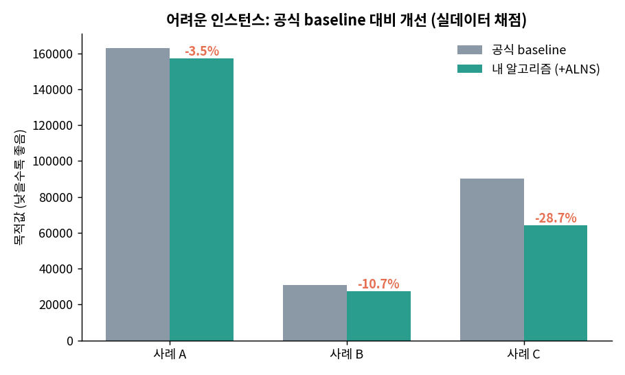
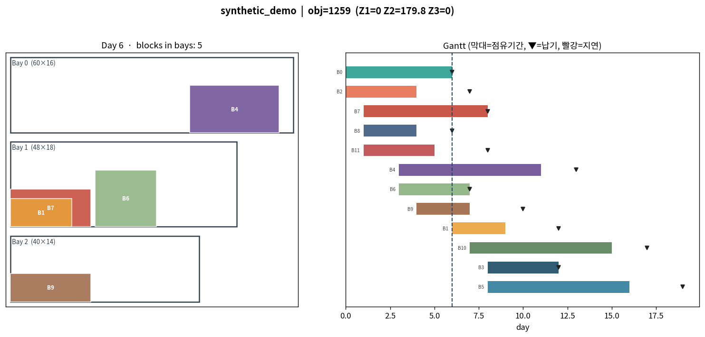
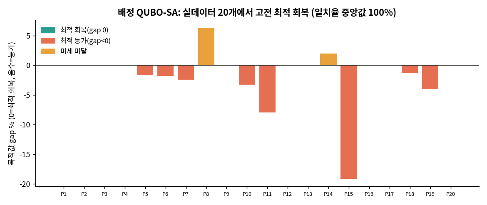

# 조선소 선박 블록 배치 최적화
### 공간과 시간을 함께 푸는 운영 최적화, 데이터 분석 포트폴리오
OGC 2026 · The Grand Shipyard Puzzle / LG CNS AX Optimization Forum 2026

> 🇰🇷 한국어 설명은 아래에 있습니다. **English version is at the bottom ([jump](#english)).**


조선소에서는 큰 배를 여러 블록으로 나눠 만들고, 각 블록을 작업장(bay) 안에서 조립한다.
이 프로젝트는 블록 하나하나를 **어느 작업장에, 어떤 방향으로, 어디에, 언제 넣고 언제 뺄지**
한꺼번에 정해 **납기 지연, 작업량 쏠림, 선호 작업장 이탈**을 가장 작게 만드는 문제를 푼다.
예측이 아니라, 규칙을 지키면서 더 나은 배치를 찾아내는 최적화다.

---

## 한눈에 보기

| | |
|---|---|
| **문제** | 비정형 3D 블록을 제한된 작업장에 배치·일정까지 동시에 결정 |
| **목표** | 납기 지연(Z1) · 작업 불균형(Z2) · 선호 손실(Z3)의 가중합 최소화 |
| **접근** | 기하 엔진 → 그리디 초기해 → ALNS 개선 → 일부 구간 MIP |
| **검증** | 대회 공식 채점기로 직접 채점, 채점 재현 정확도 100% |
| **확장** | 배정 부분을 양자(QUBO)로 전환한 하이브리드 PoC |

**대표 성과**
- 자체 목적함수 계산이 대회 채점 코드와 모든 테스트에서 정확히 맞아떨어진다(재현 100%).
- 만들어낸 해가 채점기의 5단계 검사를 전부 통과했다(무효해 없음).
- 어려운 인스턴스에서 공식 baseline보다 목적값을 평균 7.3%, 최대 28.7% 낮췄고, 더 나빠진 경우는 없다.
- 외부 라이브러리(shapely) 없이도 공식 채점기를 그대로 돌리는 순수 파이썬 기하 엔진을 만들었다.
- 배정 부분을 양자 표준형(QUBO)으로 바꿔, 실제 데이터 20개에서 고전 최적 배정을 그대로 회복했다.

---

## 풀어야 하는 문제

블록마다 다음 다섯 가지를 동시에 정한다.

1. 어느 작업장에 넣을지
2. 어떤 방향으로 돌릴지
3. 작업장 안 어디에 놓을지 (x, y)
4. 언제 넣을지 (ENTRY)
5. 언제 뺄지 (EXIT)

지켜야 하는 규칙은 세 가지다. 블록이 작업장 밖으로 나가면 안 되고, 같은 시간 같은 층에서 서로 겹쳐도
안 되고, 크레인으로 넣고 뺄 때 다른 블록이 길을 막아도 안 된다. 들어오고 나가는 시점이 제각각인
테트리스 조각을 빈틈없이 끼우면서 크레인 동선까지 챙기는 셈이다.

목적함수는 세 항의 가중합이다.

- **Z1 납기 지연**: 약속한 날보다 늦게 끝난 날수의 합
- **Z2 작업 불균형**: 가장 바쁜 작업장과 한가한 작업장의 보정 작업량 차이
- **Z3 선호 손실**: 가장 선호하는 작업장 대신 다른 곳에 둔 아쉬움의 합

목적값 $= w_1 Z_1 + w_2 Z_2 + w_3 Z_3$ 이고, 데이터에서 w1이 압도적으로 크다(1일 지연이 다른 항 수백 점에 맞먹음).
그래서 승부는 사실상 **지연을 얼마나 줄이느냐**에서 갈린다.

### 수식으로 정리

기호: 블록 `i`, 작업장 `j`, 면적 보정 가중치 `u_j = (전체 작업장 평균 면적) / (작업장 j 면적)`.
`load_j` 는 작업장 `j` 에 배정된 블록들의 workload 합이다.

목적함수 (작을수록 좋음)

```math
\begin{aligned}
Z_1 &= \sum_i \max\left(0,\ \mathrm{EXIT}_i - \mathrm{due}_i\right) \\
Z_2 &= \max_{j \neq k} \left| u_j\,\mathrm{load}_j - u_k\,\mathrm{load}_k \right| \\
Z_3 &= \sum_i \left( \max_j \mathrm{pref}(i,j) - \mathrm{pref}(i,\ j(i)) \right) \\
\text{objective} &= w_1 Z_1 + w_2 Z_2 + w_3 Z_3
\end{aligned}
```

여기서 $u_j = \dfrac{\frac{1}{m}\sum_k W_k H_k}{W_j H_j}$ 는 면적 보정 가중치이고, $\mathrm{load}_j$ 는 작업장 $j$ 에 배정된 블록들의 workload 합이다.

제약 (셋 다 만족해야 유효한 해)

- 투입·처리: $\mathrm{ENTRY}_i \ge R_i,\quad \mathrm{EXIT}_i - \mathrm{ENTRY}_i \ge P_i$
- 담기: 블록의 모든 꼭짓점이 배정된 작업장 사각형 안에 있을 것
- 충돌 없음: 같은 날 같은 층(layer)에 있는 두 블록의 내부가 겹치지 않을 것
- 크레인: 넣거나 뺄 때, 그 블록의 각 층이 다른 블록의 같은 높이 또는 더 높은 층과 겹치지 않을 것
`u_j` 보정은 큰 작업장이 같은 작업량이라도 덜 붐비는 특성을 반영해 가중치를 낮춘다.
데이터에서 `w1` 이 `w2·w3` 보다 압도적이라(1일 지연 ≈ 수만 점), 사실상 **Z1(지연) 최소화가 승부처**다.


---

## 데이터 명세

입력은 인스턴스 하나가 JSON 파일 하나다. `bays`(작업장), `blocks`(블록), `weights`(가중치) 세 부분으로 이뤄진다.

### 필드 명세서

**bays**: 작업장 목록 (0번부터 색인)

| 필드 | 타입 | 단위 | 설명 |
|---|---|---|---|
| width | int | 격자칸 | 작업장 가로 |
| height | int | 격자칸 | 작업장 세로 |

**blocks**: 블록 목록 (0번부터 색인)

| 필드 | 타입 | 단위 | 설명 |
|---|---|---|---|
| release_time | int | 일 | 투입 가능한 가장 이른 날 |
| due_date | int | 일 | 납기일 |
| processing_time | int | 일 | 처리에 걸리는 일수 |
| workload | int | — | 작업량(불균형 Z2 계산에 사용) |
| bay_preferences | int[ ] | 합 100 | 작업장별 선호 점수(높을수록 선호) |
| shape | object[ ] | — | 방향별 도형. 원소 = `{ orientation:int, layers:[다각형,...] }` |

**shape.layers** 의 다각형 = `[[x, y], ...]` 꼭짓점 목록. 첫 점은 기준점 `[0, 0]`, 나머지는 그에 대한 상대좌표(소수 가능). 층(layer)은 아래에서 위 순서.

**weights**: 목적함수 가중치 `w1`, `w2`, `w3` (int).

좌표 단위는 작업장과 같은 격자칸, 시간 단위는 일, 색인은 모두 0부터다.

### 샘플 미리보기 (공개 샘플, 동일 형식)

> 실데이터는 대회 자료라 공개하지 않는다. 아래는 형식이 같은 공개 합성 샘플(`data/sample/synthetic_demo.json`)이다. 실데이터 규모는 위 "데이터 규모" 표를 참고하면 된다.

- bays: 3개, (60×16), (48×18), (40×14)
- weights: w1=20000, w2=7, w3=150

<details>
<summary>블록 <code>head(5)</code> 펼쳐 보기 (스칼라 속성, 도형 제외)</summary>

| id | release | due | proc | workload | preferences | 방향 수 | 층 수 |
|---:|---:|---:|---:|---:|---|---:|---:|
| 0 | 0 | 6 | 6 | 49 | [6, 37, 57] | 2 | 1 |
| 1 | 6 | 12 | 3 | 19 | [28, 65, 7] | 2 | 1 |
| 2 | 0 | 7 | 4 | 18 | [52, 2, 46] | 2 | 1 |
| 3 | 8 | 12 | 4 | 51 | [23, 63, 14] | 2 | 1 |
| 4 | 3 | 13 | 8 | 21 | [82, 9, 9] | 2 | 1 |

</details>

도형 예로 block 0, 방향 0, 층 0은 `[[0,0], [15,0], [15,7], [0,7]]`이다(가로 15·세로 7 사각형). 실데이터는 보통 한 블록에 방향 8개, 각 층이 비정형 8각형 안팎이다.

### 출력(해) 형식

`operations` 딕셔너리로, 날짜에서 그 날 수행할 작업 목록으로 이어진다.

```jsonc
{ "operations": {
  "0": [ {"type":"ENTRY","block_id":3,"bay_id":1,"x":12,"y":0,"orient_idx":2} ],
  "8": [ {"type":"EXIT","block_id":3,"bay_id":1} ]
}}
```
ENTRY는 위치와 방향까지, EXIT는 블록과 작업장만 적는다. 같은 날에는 EXIT를 ENTRY보다 먼저 두고, 좌표는 정수여야 한다.

## 분석 흐름

데이터 분석가가 일하는 순서 그대로 따라갔다.

1. **문제 정의**: 현업 목표를 목적함수와 제약으로 옮긴다.
2. **데이터 수집과 구조화**: 원문 JSON을 작업장·블록·도형 표로 정규화한다.
3. **탐색적 분석(EDA)**: 규모, 납기 여유, 선호 분포를 보고 무엇이 점수를 좌우하는지 찾는다.
4. **모델링(최적화)**: 그리디로 초기해를 만들고 ALNS로 개선하며, 막힌 구간은 MIP로 다듬는다.
5. **평가와 검증**: 공식 채점기로 feasibility와 목적값을 직접 확인한다.
6. **인사이트 도출**: 지연이 어디서 생기고 어떻게 줄어드는지 결론을 정리한다.

### 분석에서 찾은 핵심
- 지연을 만드는 진짜 원인은 일정이 아니라 **공간 혼잡**이다. 블록 하나만 놓고 보면 모두 제때 끝낼 수 있지만(지연 하한 0),
  한 작업장에 몰리면 늦게 들어갈 수밖에 없어 지연이 생긴다. 그래서 **동시에 더 많이 끼워 넣는 패킹**이 핵심 지렛대다.
- 납기 여유가 평균 하루 남짓으로 빡빡하다. 투입이 조금만 늦어도 곧장 지연으로 이어진다.
- feasibility는 통과와 탈락만 있다. 규칙 하나만 어겨도 그 인스턴스는 0점이라, **항상 말이 되는 해**를 내는 안정성이 곧 점수다.

### 데이터 규모 (실데이터 20개)

| 항목 | 값 |
|---|---|
| 인스턴스 수 | 20 |
| 블록 수 | 100 ~ 300 |
| 작업장(bay) 수 | 2 ~ 5 |
| w1 (납기 가중치) | 8,889 ~ 29,630 (압도적) |
| 평균 납기 여유(slack) | 약 1.4일 |
| 납기 지연 하한 | 0 — 지연은 일정이 아니라 공간 혼잡에서 발생 |


---

## 풀이 방법

| 단계 | 하는 일 | 담당 |
|---|---|---|
| 기하 엔진 (`geometry.py`) | 담기·충돌·크레인 규칙 판정과 날짜순 시뮬레이션 | 제약 |
| 후보 생성 (`candidates.py`) | 놓을 만한 방향·위치만 추려 탐색량을 줄임 | 탐색 효율 |
| 그리디 (`greedy.py`) | 급한 블록부터 빠르게 초기해 생성(항상 통과) | 초기해 |
| ALNS (`alns_improve.py`) | 지연 큰 블록을 빼서 더 이른 시점·덜 붐비는 곳으로 재배치 | 지연 개선 |
| 일부 구간 MIP | 가장 막히는 구간만 상용 솔버로 정밀 재최적화 | 국소 최적 |

진입점은 `myalgorithm.py`다. 공식 baseline 해에서 출발해 ALNS로 다듬고, 채점기로 검증한 가장 좋은 해를 돌려준다.

---

## 결과

공식 채점기로 직접 측정했다.

| 인스턴스 | 공식 baseline | 내 알고리즘 | 변화 |
|---|---|---|---|
| 어려운 사례 A | 162,985 | 157,317 | −3.5% |
| 어려운 사례 B | 30,868 | 27,564 | −10.7% |
| 어려운 사례 C | 90,242 | 64,305 | **−28.7%** |

어려운 묶음 합계로는 7.3% 낮췄고, 쉬운 인스턴스는 baseline이 이미 지연 0이라 같은 값이 나온다(더 나빠진 경우 없음).


*그림. 어려운 인스턴스에서 공식 채점기로 측정한 baseline 대비 개선.*

**사례 A·B·C는 무엇인가.** 혼잡을 일부러 강하게 만든 스트레스 테스트 인스턴스다. 블록이 작업장을 빡빡하게 채우도록 구성해, 개선 효과가 드러나는 어려운 상황을 재현했다. baseline과 내 알고리즘을 **공식 채점기로 똑같이 채점**해 비교했다. 쉬운 인스턴스는 baseline도 이미 지연이 0이라 차이가 없고, 차이는 이렇게 빡빡할 때 벌어진다.

**감소가 뜻하는 것.** 목적값은 `w1·Z1`(납기 지연)이 거의 전부를 좌우한다(1일 지연이 수만 점). 목적값을 28.7% 줄였다는 말은 사실상 **지연을 크게 줄였다**는 뜻이다. 현장 언어로 옮기면, 블록들이 납기에 더 가깝게 끝나 뒤 공정의 대기와 체선이 줄어든다. 같은 작업장에 같은 블록이라도 충돌 없이 더 일찍, 더 촘촘히 끼워 넣어 늦게 들어가던 블록을 줄인 결과다.


---

## 차별점

- **순수 파이썬 채점 재현**: 공식 채점기는 도형 라이브러리(shapely)에 의존한다. 다각형 교차와 차집합 면적을
  삼각분할과 볼록 클리핑으로 직접 구현해, 라이브러리 없이도 공식 채점기를 그대로 돌린다. 정확도는 사각형에서
  오차 약 1e-15, 오목 다각형에서 몬테카를로 추정치와 일치하도록 검증했다.
- **결과 시각화**: 날짜별 작업장 배치와 Gantt, 목적값 분해를 그림으로 보여준다. 정적 이미지와 브라우저
  인터랙티브(Streamlit)를 둘 다 제공하고, GitHub Codespaces에서 바로 띄울 수 있다.


*그림. 날짜별 배치와 Gantt 예시. 형식을 보여주는 예시이며 합성 샘플로 렌더링(실데이터 도형은 미공개).*

- **양자 하이브리드 PoC**: 배정 부분을 QUBO로 바꿔 양자(D-Wave/QAOA)와 고전(SA)이 같은 방식으로 풀게 했다.
  실데이터 20개에서 고전 최적 배정을 그대로 회복했고(일치율 중앙값 100%), 일부는 미세하게 능가했다.
  다만 이 데이터는 선호 가중치가 균형 가중치보다 훨씬 커서 배정 자체가 쉬운 문제라, 양자가 실익을 주는 지점은
  배정이 아니라 혼잡을 만드는 동시배치 선택이라는 결론을 정직하게 담았다.


*그림. 배정 QUBO-SA가 실데이터 20개에서 고전 최적 배정을 회복(대부분 0 이하는 회복 또는 능가).*


---

## 양자 PoC 자세히

### P1 ~ P20은 무엇인가
공식 training 인스턴스 20개다(블록 100 \~ 300, 작업장 2~5, 가중치와 일정 구성이 제각각). 위 회복률 차트에서 막대 하나가 인스턴스 하나이고, 세로축은 QUBO를 푼 배정이 **고전 최적 배정 대비 목적값이 얼마나 차이 나는지**(gap %)를 나타낸다. 0이면 최적을 그대로 회복, 음수면 오히려 더 나음을 뜻한다.

<details>
<summary>P1~P20 규모별 구성 펼쳐 보기</summary>

| 그룹 | 인스턴스 | 블록 수 | 작업장 수 |
|---|---|---|---|
| 소규모 | P1~P4 | 100 | 2~3 |
| 중간 | P5~P8 | 150 | 2~3 |
| 대규모 | P9~P16 | 200~250 | 3~4 |
| 초대규모 | P17~P20 | 300 | 4~5 |

가중치 범위: w1 8,889~29,630 · w2 4~10 · w3 125~200 (인스턴스마다 다름).

</details>

### 배정을 QUBO로 바꾸기
변수 `x(i,j)=1` 은 블록 `i` 를 작업장 `j` 에 배정한다는 뜻이다. 다음을 최소화한다.

```math
\min\;\; \underbrace{A \sum_i \Big(\sum_j x_{ij} - 1\Big)^2}_{\text{one bay / block}}
\;+\; \underbrace{w_3 \sum_{i,j} \big(\mathrm{pref}^{\max}_i - \mathrm{pref}_{ij}\big)\, x_{ij}}_{Z_3}
\;+\; \underbrace{w_2' \sum_j \Big(u_j \sum_i L_i\, x_{ij}\Big)^2}_{\text{balance }(Z_2)}
```

$x_{ij}\in\{0,1\}$ 은 블록 $i$ 를 작업장 $j$ 에 배정하면 1이다 ($A$ 는 충분히 큰 페널티).
이 형태(QUBO)는 D-Wave 어닐러, Qiskit QAOA, 고전 SA가 **모두 같은 방식으로** 받아 풀 수 있어, 백엔드만 바꿔 비교했다.

### 왜 (이 데이터에선) 양자가 실익이 없나
이 데이터는 `w3`(선호 125~200)가 `w2`(균형 4~10)보다 훨씬 크다. 그래서 배정의 최적해는 거의 "모두 최선호 작업장"이고, 블록마다 따로따로 정해도 된다(near-separable, 거의 분리 가능). 배정 자체가 **고전적으로 쉬운 문제**라 양자를 써도 더 나아질 여지가 거의 없다. 실제로 고전 SA가 20개 모두에서 최적을 그대로 회복했다(차트).

### 그럼 양자가 실익을 줄 곳은 어디인가
진짜 어려움은 압도적 가중치 `w1` 이 걸린 **지연(Z1)** 에 있고, 지연은 "한 작업장·한 시간창에 충돌 없이 어떤 블록들을 함께 넣을까"라는 선택에서 생긴다. 이 선택은 **충돌 그래프 위의 최대 가중 독립집합**(서로 부딪치지 않는 블록을, 가치 합이 최대가 되도록 고르기) 문제다. NP-hard이고 변수들이 충돌로 촘촘히 얽혀 있어, 이런 빽빽한 조합 선택이야말로 양자(어닐링·QAOA)가 노려볼 만한 구조다.

동시배치 QUBO 스케치. 한 작업장·한 시간창에서 변수 `x(b)=1`(블록 b 투입):

```math
\min\;\; A \!\!\sum_{(b,b')\,\in\,\text{conflict}}\!\! x_b\, x_{b'} \;\;-\;\; \sum_b \mathrm{value}_b\, x_b
```

충돌쌍은 동시에 못 고르도록 벌점을 주고($A$), 납기 임박 블록일수록 $\mathrm{value}_b$ 를 크게 둬 많이, 일찍 투입되게 한다.
충돌 행렬은 이미 만든 기하 엔진으로 미리 계산한다.

요약하면, 배정 QUBO는 "수식과 인터페이스가 올바르다"를 보인 검증용 데모이고, 양자의 실익은 배정이 아니라 **혼잡을 만드는 동시배치 선택**에 있다.

## 저장소 구조

```
algorithm/            핵심 알고리즘
  geometry.py           기하·제약 판정 + 날짜순 시뮬레이션
  candidates.py         배치 후보(방향·위치) 생성
  greedy.py             초기해 생성(항상 통과)
  alns_improve.py       ALNS 개선(지연 블록 제거 후 재배치)
  localsearch.py        보조 탐색
  evaluator.py          목적함수 Z1/Z2/Z3 (공식 채점기와 일치 검증)
  myalgorithm.py        제출 진입점
tools/                분석·벤치마크
  analyze_instance.py   단일 인스턴스 분석
  analyze_all.py        폴더 일괄 분석
  run_benchmark.py      단일 인스턴스 baseline 비교
  run_benchmark_batch.py 폴더 일괄 비교
  solve_to_json.py      해를 만들어 파일로 저장
pure_python_scorer/   shapely 없이 공식 채점기 실행
  polygeom.py           순수 파이썬 다각형 면적 계산
  pyshapely_shim.py     가짜 shapely 등록(한 줄로 채점 가능)
quantum_poc/          양자 하이브리드 PoC
  qubo.py               배정 QUBO 빌더 + 풀이기
  demo_local.py         설치 없이 도는 데모
  qubo_batch.py         폴더 일괄 PoC
  run_dwave.py          D-Wave 어닐러 실행
  run_qiskit.py         Qiskit QAOA 실행
  integrate_pipeline.py 배정→스케줄→채점 연결
viz/                  결과 시각화
  visualize.py          배치·Gantt·목적값 이미지
  app_streamlit.py      브라우저 인터랙티브 앱
docs/                 발표·안내 자료
  portfolio_deck.pptx   18장 포트폴리오 발표자료
  beginner_guide_ko.pdf 비전공자용 안내서
data/sample/          공개 가능한 작은 샘플(즉시 실행용)
competition/          대회 제공 파일 자리(직접 채워 넣기)
```

---

## 빠른 시작

설치 없이 동봉한 샘플로 바로 돌아간다(아래 셋은 shapely 없이 동작).

```bash
python tools/analyze_all.py             # 샘플 분석
python quantum_poc/demo_local.py        # 배정 QUBO 데모
python viz/visualize.py data/sample/synthetic_demo.json data/sample/synthetic_demo_solution.json --day 6 --out viz_out
```

전체 채점과 벤치마크는 대회 파일이 필요하다.

```bash
pip install -r requirements.txt
python tools/run_benchmark.py
```

shapely 설치가 번거로우면 순수 파이썬 채점기로 대체한다.

```python
import sys; sys.path.insert(0, "pure_python_scorer")
import pyshapely_shim   # 가짜 shapely 등록 (utils 불러오기 전에)
import utils            # 이제 shapely 없이 동작
```

---

## GitHub Codespaces에서 작업하고 결과 보기

1. 저장소 페이지에서 **Code ▸ Codespaces ▸ Create codespace on main**을 누른다.
2. 컨테이너가 뜨면 `.devcontainer` 설정이 의존성(shapely·numpy·matplotlib·streamlit)과 한글 폰트를 자동으로 설치한다.
3. 채점까지 쓰려면 `competition/`에 `utils.py`와 `baseline_greedy.py`를, `data/train/`에 인스턴스를 넣는다.
4. 브라우저로 결과 보기:
   ```bash
   streamlit run viz/app_streamlit.py
   ```
   8501 포트가 자동으로 열린다. 날짜 슬라이더로 배치가 어떻게 바뀌는지 본다.
5. 이미지로만 보려면 `python viz/visualize.py <인스턴스> [해.json] --day N` 을 쓴다.

해 만들기: `python tools/solve_to_json.py data/train/prob_1.json --time 60`

---

## 대회 제공 파일 (포함하지 않음)

공식 `utils.py`, `baseline_greedy.py`와 training 데이터는 대회 자료라 저장소에 넣지 않았다.
직접 받아 `competition/`과 `data/train/`에 넣으면 채점과 벤치마크가 모두 동작한다. 자세한 위치는
각 폴더의 README에 적어 두었다.

## 환경

- Python 3.9 이상
- 핵심: `shapely`, `numpy` (`requirements.txt`)
- 시각화: `matplotlib`, `streamlit` (`requirements-viz.txt`)
- 양자(선택): `dwave-ocean-sdk` 또는 `qiskit qiskit-optimization qiskit-aer` (모두 무료)

## 라이선스

MIT. 본인이 작성한 코드에만 적용되며, 대회 제공 코드와 데이터는 포함하지 않고 각 출처 정책을 따른다.


---
<a name="english"></a>
# Shipyard Block Placement Optimization
### Joint space–time operations optimization — a data analysis portfolio
OGC 2026 · The Grand Shipyard Puzzle / LG CNS AX Optimization Forum 2026

In a shipyard, a ship is built as many large blocks, and each block is assembled inside a fixed
workspace called a bay. This project decides, for every block at once, **which bay, which orientation,
where (x, y), when to bring it in (ENTRY) and when to take it out (EXIT)** so that **tardiness,
workload imbalance, and preference loss** are as small as possible. It is not a prediction task —
it searches for a better placement while satisfying hard rules.

---

## At a glance

| | |
|---|---|
| **Problem** | Place irregular 3D blocks into limited bays and schedule them together |
| **Goal** | Minimize a weighted sum of tardiness (Z1), workload imbalance (Z2), preference loss (Z3) |
| **Approach** | Geometry engine → greedy start → ALNS improvement → MIP on bottleneck windows |
| **Validation** | Scored with the official checker; objective reproduced exactly (100% match) |
| **Extension** | Hybrid PoC that turns the assignment part into a quantum QUBO |

**Key results**
- The in-house objective matches the official scoring code exactly across every test (100% reproduction).
- Every produced solution passes all five feasibility stages of the checker (zero infeasible solutions).
- On hard instances the objective drops by 7.3% on average and up to 28.7% versus the official baseline, with no regressions.
- A pure-Python geometry engine runs the official checker without the external library (shapely).
- The assignment subproblem maps cleanly to a QUBO and recovers the classical optimum on all 20 real instances.

---

## The problem

For each block, five decisions are made at the same time:

1. which bay
2. which orientation
3. where inside the bay (x, y)
4. when to bring it in (ENTRY)
5. when to take it out (EXIT)

Three rules must hold: a block stays fully inside its bay, blocks on the same layer never overlap at the
same time, and the crane path is never blocked when a block enters or leaves. Think of it as Tetris where
each piece has its own arrival and departure time and the crane matters too.

The objective is a weighted sum:

- **Z1 — tardiness:** total days finished later than promised
- **Z2 — workload imbalance:** the gap in adjusted workload between the busiest and least busy bay
- **Z3 — preference loss:** the cost of placing a block somewhere other than its most preferred bay

Objective = w1·Z1 + w2·Z2 + w3·Z3. In the data, w1 dominates by far (one day of delay rivals hundreds of
points elsewhere), so the game is mostly about **reducing tardiness**.

### Formulation

Notation: block `i`, bay `j`, area weight `u_j = (mean bay area) / (area of bay j)`;
`load_j` is the total workload of blocks assigned to bay `j`.

Objective (smaller is better)

```math
\begin{aligned}
Z_1 &= \sum_i \max\left(0,\ \mathrm{EXIT}_i - \mathrm{due}_i\right) \\
Z_2 &= \max_{j \neq k} \left| u_j\,\mathrm{load}_j - u_k\,\mathrm{load}_k \right| \\
Z_3 &= \sum_i \left( \max_j \mathrm{pref}(i,j) - \mathrm{pref}(i,\ j(i)) \right) \\
\text{objective} &= w_1 Z_1 + w_2 Z_2 + w_3 Z_3
\end{aligned}
```

where $u_j = \dfrac{\frac{1}{m}\sum_k W_k H_k}{W_j H_j}$ is the area-correction weight and $\mathrm{load}_j$ is the total workload assigned to bay $j$.
Constraints (all must hold): containment (every vertex inside the bay), no overlap (interiors of two
blocks on the same layer/day must not intersect), and crane feasibility (when a block enters or leaves,
each of its layers must clear other blocks at the same or higher layer). Because `w1` dominates
`w2·w3` (one day of delay is worth tens of thousands of points), the game is essentially **minimizing Z1**.


---

## Data specification

Each instance is one JSON file with three parts: `bays`, `blocks`, `weights`.

**bays** (0-indexed): `width` (int, grid cells), `height` (int, grid cells).

**blocks** (0-indexed):

| Field | Type | Unit | Description |
|---|---|---|---|
| release_time | int | day | earliest day the block can enter |
| due_date | int | day | due date |
| processing_time | int | day | days needed to process |
| workload | int | — | workload (used for imbalance Z2) |
| bay_preferences | int[ ] | sums to 100 | per-bay preference score |
| shape | object[ ] | — | per-orientation geometry: `{ orientation:int, layers:[polygon,...] }` |

A polygon in `shape.layers` is a vertex list `[[x,y],...]`; the first vertex is the reference point
`[0,0]` and the rest are relative (may be fractional). Layers go bottom to top. `weights` holds `w1,w2,w3`.

### Sample preview (public sample, same schema)

> Real instances are competition material and are not published. Below is the public synthetic sample
> (`data/sample/synthetic_demo.json`); see "Data at a glance" above for the real-data scale.

bays: (60×16), (48×18), (40×14) · weights: w1=20000, w2=7, w3=150

<details>
<summary>Expand <code>head(5)</code> of blocks (scalar fields, shapes omitted)</summary>

| id | release | due | proc | workload | preferences | orients | layers |
|---:|---:|---:|---:|---:|---|---:|---:|
| 0 | 0 | 6 | 6 | 49 | [6, 37, 57] | 2 | 1 |
| 1 | 6 | 12 | 3 | 19 | [28, 65, 7] | 2 | 1 |
| 2 | 0 | 7 | 4 | 18 | [52, 2, 46] | 2 | 1 |
| 3 | 8 | 12 | 4 | 51 | [23, 63, 14] | 2 | 1 |
| 4 | 3 | 13 | 8 | 21 | [82, 9, 9] | 2 | 1 |

</details>

Shape example — block 0, orientation 0, layer 0: `[[0,0],[15,0],[15,7],[0,7]]` (a 15×7 rectangle).
Real blocks typically have 8 orientations with irregular ~8-vertex layers.

### Output (solution) format

`operations` maps a day to the actions on that day. ENTRY carries position and orientation; EXIT carries
only block and bay. On the same day, EXIT comes before ENTRY, and coordinates must be integers.

## Analysis workflow

The project follows the usual analyst workflow:

1. **Define the problem** — translate the business goal into an objective and constraints.
2. **Collect and structure data** — normalize the raw JSON into bay, block, and shape tables.
3. **Explore (EDA)** — study size, schedule slack, and preference spread to find what drives the score.
4. **Model (optimize)** — build a greedy start, improve with ALNS, and refine tight windows with MIP.
5. **Validate** — check feasibility and objective with the official scorer directly.
6. **Draw insights** — explain where delay comes from and how it shrinks.

### What the analysis found
- Delay is driven by **spatial congestion**, not the schedule. Each block alone could finish on time
  (tardiness lower bound is zero), but when blocks pile into one bay they enter late. So **packing more
  blocks concurrently** is the main lever.
- Schedule slack averages about one day, so even a slightly late entry turns into delay.
- Feasibility is pass-or-fail: a single broken rule scores zero on that instance, so **always returning a
  valid solution** is itself worth points.

### Data at a glance (20 real instances)

| Field | Value |
|---|---|
| Instances | 20 |
| Blocks | 100 – 300 |
| Bays | 2 – 5 |
| w1 (tardiness weight) | 8,889 – 29,630 (dominant) |
| Mean schedule slack | ~1.4 days |
| Tardiness lower bound | 0 — delay comes from spatial congestion, not the schedule |


---

## How it is solved

| Stage | What it does | Role |
|---|---|---|
| Geometry engine (`geometry.py`) | Containment, collision, crane checks + day-by-day simulation | Constraints |
| Candidate generation (`candidates.py`) | Keeps only sensible orientation/position options | Search efficiency |
| Greedy (`greedy.py`) | Builds a fast initial solution that always passes | Initial solution |
| ALNS (`alns_improve.py`) | Removes tardy blocks and repacks them earlier / in less crowded bays | Tardiness |
| MIP on windows | Re-optimizes the most congested window with a commercial solver | Local optimum |

The entry point is `myalgorithm.py`: it starts from the official baseline solution, improves it with ALNS,
and returns the best solution that the checker confirms as feasible.

---

## Results

Measured with the official checker.

| Instance | Official baseline | This algorithm | Change |
|---|---|---|---|
| Hard case A | 162,985 | 157,317 | −3.5% |
| Hard case B | 30,868 | 27,564 | −10.7% |
| Hard case C | 90,242 | 64,305 | **−28.7%** |

The hard set drops by 7.3% in total. Easy instances tie because the baseline already reaches zero tardiness
(never worse).


*Improvement over the official baseline on hard instances, measured with the official checker.*

**What are cases A/B/C?** Stress-test instances built to be congestion-heavy, so improvement is visible.
Baseline and my algorithm are scored on the same footing with the official checker. Easy instances tie
because the baseline already reaches zero tardiness; the gap opens up only when packing is tight.

**What the reduction means.** The objective is dominated by `w1·Z1` (tardiness), so a 28.7% drop means
tardiness fell sharply — in plant terms, blocks finish closer to their due dates, reducing downstream
waiting and congestion. With the same bays and blocks, fitting them in earlier and tighter (without
collisions) leaves fewer late blocks.


---

## What makes it stand out

- **Pure-Python scoring** — the official checker depends on a geometry library (shapely). I implemented
  polygon intersection and difference areas with triangulation and convex clipping, so the official checker
  runs without that library. Accuracy was verified to about 1e-15 on rectangles and against Monte Carlo on
  concave polygons.
- **Result visualization** — bay layout per day, a Gantt chart, and an objective breakdown, as both static
  images and a browser app (Streamlit) that opens directly in GitHub Codespaces.


*Layout-per-day and Gantt example — a format demo rendered on the synthetic sample (real shapes not published).*

- **Quantum hybrid PoC** — the assignment part becomes a QUBO so a quantum solver (D-Wave/QAOA) and a
  classical one (SA) solve it the same way. It recovered the classical optimum on all 20 real instances
  (median agreement 100%) and occasionally beat it. Honestly, though, preference weight far outweighs balance
  weight here, so assignment is an easy subproblem — the place quantum could actually help is the concurrent
  co-placement that creates congestion, not assignment.


*Assignment QUBO-SA recovers the classical optimum across 20 real instances (mostly at or below zero = recover/beat).*


---

## Quantum PoC in detail

**What are P1–P20?** The 20 official training instances (100–300 blocks, 2–5 bays, varied weights and
schedules). In the recovery chart, each bar is one instance and the y-axis is the objective gap of the
QUBO assignment versus the classical optimum (0 = recovers the optimum, negative = beats it).

<details>
<summary>P1–P20 size groups</summary>

| Group | Instances | Blocks | Bays |
|---|---|---|---|
| Small | P1–P4 | 100 | 2–3 |
| Medium | P5–P8 | 150 | 2–3 |
| Large | P9–P16 | 200–250 | 3–4 |
| Extra-large | P17–P20 | 300 | 4–5 |

Weight ranges: w1 8,889–29,630 · w2 4–10 · w3 125–200 (varies per instance).

</details>

**Assignment as a QUBO.** With `x(i,j)=1` meaning "block i in bay j":

```math
\min\;\; \underbrace{A \sum_i \Big(\sum_j x_{ij} - 1\Big)^2}_{\text{one bay per block}}
\;+\; \underbrace{w_3 \sum_{i,j} \big(\mathrm{pref}^{\max}_i - \mathrm{pref}_{ij}\big)\, x_{ij}}_{Z_3}
\;+\; \underbrace{w_2' \sum_j \Big(u_j \sum_i L_i\, x_{ij}\Big)^2}_{\text{balance }(Z_2)}
```

This QUBO form is fed identically to a D-Wave annealer, Qiskit QAOA, and classical SA.

**Why quantum gives no edge on this data.** Here `w3` (preference, 125–200) far exceeds `w2` (balance,
4–10), so the optimal assignment is essentially "everyone to their most preferred bay" and decomposes per
block (near-separable). Assignment is therefore an easy classical problem, and SA recovers the optimum on
all 20 instances.

**Where quantum could actually help.** The real difficulty sits in tardiness (Z1), carrying the dominant
`w1`. Tardiness comes from choosing *which blocks to co-place in one bay and time window without colliding*
— a **maximum-weight independent set** on a conflict graph (NP-hard, densely coupled). That is the kind of
tightly-coupled combinatorial selection an annealer/QAOA is suited to. Sketch (one bay, one window,
`x(b)=1` if block b is placed):

```math
\min\;\; A \!\!\sum_{(b,b')\,\in\,\text{conflict}}\!\! x_b\, x_{b'} \;\;-\;\; \sum_b \mathrm{value}_b\, x_b
```

with the conflict matrix precomputed by the existing geometry engine. In short, the assignment QUBO
validates the formulation and interface; the real quantum opportunity is the co-placement that drives
congestion, not assignment.

## Repository layout

```
algorithm/            core algorithm
  geometry.py           constraint checks + day-by-day simulation
  candidates.py         placement candidates (orientation, position)
  greedy.py             initial solution (always feasible)
  alns_improve.py       ALNS improvement (remove tardy blocks, repack)
  localsearch.py        auxiliary search
  evaluator.py          objective Z1/Z2/Z3 (matches the official checker)
  myalgorithm.py        submission entry point
tools/                analysis & benchmarking
  analyze_instance.py   single-instance analysis
  analyze_all.py        batch analysis over a folder
  run_benchmark.py      single-instance comparison vs baseline
  run_benchmark_batch.py batch comparison
  solve_to_json.py      produce a solution and save it
pure_python_scorer/   run the official checker without shapely
  polygeom.py           pure-Python polygon area computation
  pyshapely_shim.py     register a fake shapely (one import enables scoring)
quantum_poc/          quantum hybrid PoC
  qubo.py               assignment QUBO builder + solvers
  demo_local.py         runs with no installation
  qubo_batch.py         batch PoC over a folder
  run_dwave.py          D-Wave annealer
  run_qiskit.py         Qiskit QAOA
  integrate_pipeline.py assignment → schedule → scoring
viz/                  result visualization
  visualize.py          layout / Gantt / objective images
  app_streamlit.py      interactive browser app
docs/                 deck & guide
  portfolio_deck.pptx   18-slide portfolio deck
  beginner_guide_ko.pdf beginner guide (Korean)
data/sample/          a small public sample (runs out of the box)
competition/          slot for competition-provided files (add your own)
```

---

## Quickstart

The bundled sample runs with no setup (these three need no shapely):

```bash
python tools/analyze_all.py
python quantum_poc/demo_local.py
python viz/visualize.py data/sample/synthetic_demo.json data/sample/synthetic_demo_solution.json --day 6 --out viz_out
```

Full scoring and benchmarking need the competition files:

```bash
pip install -r requirements.txt
python tools/run_benchmark.py
```

If installing shapely is inconvenient, use the pure-Python scorer:

```python
import sys; sys.path.insert(0, "pure_python_scorer")
import pyshapely_shim   # register the fake shapely (before importing utils)
import utils            # now works without shapely
```

---

## Working in GitHub Codespaces

1. On the repo page, choose **Code ▸ Codespaces ▸ Create codespace on main**.
2. Once the container starts, `.devcontainer` installs the dependencies (shapely, numpy, matplotlib,
   streamlit) and Korean fonts automatically.
3. For scoring, drop `utils.py` and `baseline_greedy.py` into `competition/` and instances into `data/train/`.
4. See results in the browser:
   ```bash
   streamlit run viz/app_streamlit.py
   ```
   Port 8501 forwards automatically; use the day slider to watch the layout change.
5. For images only, run `python viz/visualize.py <instance> [solution.json] --day N`.

Make a solution: `python tools/solve_to_json.py data/train/prob_1.json --time 60`

---

## Competition files (not included)

The official `utils.py`, `baseline_greedy.py`, and the training data are competition material and are not
included. Add them to `competition/` and `data/train/` to enable scoring and benchmarking. Each folder's
README explains where things go.

## Environment

- Python 3.9+
- Core: `shapely`, `numpy` (`requirements.txt`)
- Visualization: `matplotlib`, `streamlit` (`requirements-viz.txt`)
- Quantum (optional): `dwave-ocean-sdk` or `qiskit qiskit-optimization qiskit-aer` — all free

## License

MIT, for the code I wrote. Competition-provided code and data are not included and follow their own terms.
